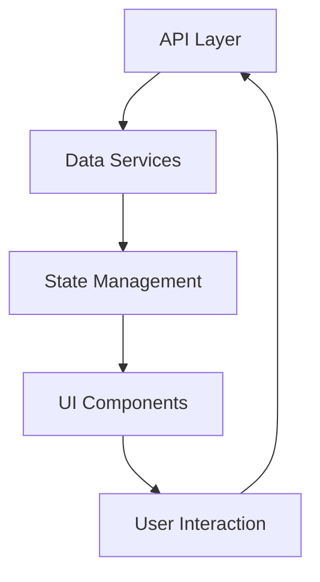

# System Patterns

## Architecture Overview
PredictBet follows a modern web application architecture with:
- Next.js for server-side rendering and routing
- Component-based UI structure
- TypeScript for type safety
- Tailwind CSS for styling

## Design Patterns

### Component Structure
```
components/
├── ui/           # Reusable UI components
├── features/     # Feature-specific components
└── layout/       # Layout components
```

### Component Patterns
1. Presentational Components
   - Pure UI rendering
   - Prop-based configuration
   - Tailwind styling

2. Container Components
   - Business logic
   - Data fetching
   - State management

3. Custom Hooks
   - Reusable logic
   - State management
   - Event handling

### Data Flow


## Technical Decisions

### UI Framework
- Next.js chosen for:
  - Server-side rendering
  - TypeScript support
  - Performance optimization
  - Route handling

### Styling
- Tailwind CSS for:
  - Utility-first approach
  - Responsive design
  - Component consistency
  - Easy customization

### Component Library
- Custom UI components for:
  - Design consistency
  - Reusability
  - Maintainability
  - Performance

### Data Visualization
- Custom chart components for:
  - Fighter statistics
  - Performance metrics
  - Trend analysis
  - Comparison data

## Component Relationships

### Feature Components
1. Fighter Profiles
   - Data visualization
   - Statistics display
   - Historical records

2. Comparison Tool
   - Head-to-head stats
   - Visual comparisons
   - Data analysis

3. Predictor
   - Data processing
   - Probability calculation
   - Result display

4. Social Feed
   - Real-time updates
   - Sentiment analysis
   - Trend tracking

### Shared Components
1. UI Elements
   - Buttons
   - Cards
   - Forms
   - Charts

2. Layout Components
   - Navigation
   - Sidebar
   - Headers
   - Footers

## Performance Considerations
- Component lazy loading
- Image optimization
- Data caching
- Server-side rendering
- API request optimization